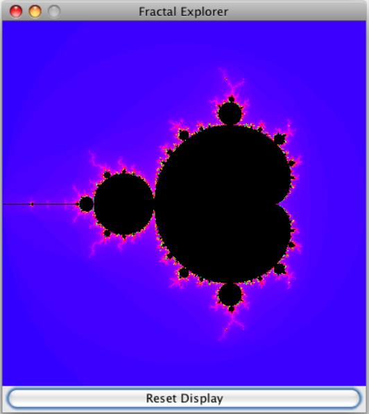
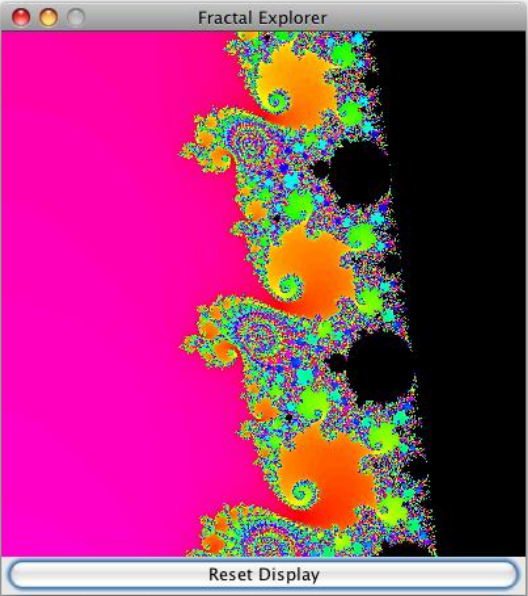
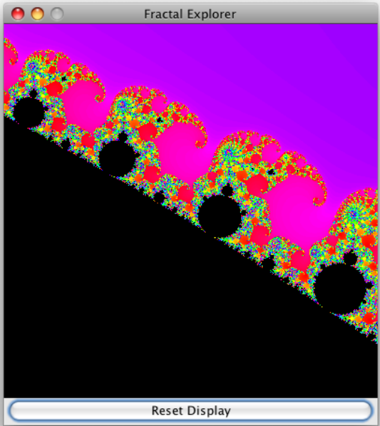

# Lab Java and Kotlin 

# Lab 1
## Задание #1. Знакомство с языком Java

На этой неделе начнем изучение основ синтаксиса языка Java с решения нескольких
простых программных проблем. Вы также научитесь использовать компилятор Java и
виртуальную машину Java для запуска ваших программ. Ниже приведено описание задач,
которые вам необходимо решить:
Простые числа
Простые числа часто встречаются в задачах по программированию и наш курс не
исключение! Для начала вы должны сделать программу, которая находит и печатает все
простые числа меньше 100. Эта задача даст вам возможность попрактиковаться в
написании циклов и функций на языке Java.
Создайте файл Primes.java, и в этом файле создайте класс как этот:
```java
/**
* TODO: Комментарии, описывающие ваш класс
  */
  public class Primes {
    /**
     * TODO: Комментарии, описывающие этот метод
     */
    public static void main(String[] args) {
        // TODO: здесь напишите свой код
    }
}
  ```
  После создания файла вы можете откомпилировать и запустить программу, но конечно
  пока еще рано делать это. Сначала надо добавить нужный код.
  Внутри класса, после метода main(), добавьте функцию isPrime(int n) которая определяет,
  является ли число простым. Можно считать, что входное значение n всегда больше 2.
  Сигнатура этой функции будет такой:
```java
  public static boolean isPrime(int n){
        // TODO: ваша реализация функции
  }
  ```
  Вы можете реализовать этот метод так, как считаете нужным, но довольно просто сделать
  это с помощью цикла for который перебирает все значения, начиная с 2 до (но, не
  включая) n, проверяя, делится ли n нацело на это значение. Это можно проверить с
  помощью оператора деления по модулю %; например, 17 % 7 равно 3, а 16 % 4 равно 0.
  Если какое либо значение нацело делит аргумент n, return false; если такое значение не
  найдено, то аргумент это простое число: return true. (Оператор return в языке Java
  завершает исполнение метода и возвращает значение вызывающей программе.)
  После того как этот метод написан, вы можете добавить в метод main() другой цикл,
  который перебирает числа от 2 до 100, включительно, печатая числа
  которые isPrime() определяет как простые.
  Откомпилируйте программу и проверьте корректность ее работы! В сети Интернет можно
  найти много таблиц простых чисел, так что проверить результат работы программы будет
  несложно.

Так же там где это указано в заготовке программы добавьте комментарии описывающие
назначение класса и каждого из методов класса. Очень важно вставлять такие
комментарии в свои программы.
Палиндромы
Вторая ваша программа должна определять является ли строка палиндромом. Есть
несколько способов решения этой задачи, но мы выберем тот, который позволит вам
познакомится на практике со свойствами языка Java, которые обсуждались на первой
лекции.
Для этой программы, вы должны создать класс с именем Palindrome, в
файле Palindrome.java. На этот раз можете начать с такого исходного текста:
```java
/**
* TODO: Комментарии с описанием класса
  */
  public class Palindrome {
    /**
     * TODO: Комментарии с описанием метода
     */
    public static void main(String[] args) {
        for(int i = 0; i < args.length; i++) {
            String s = args[i];
            // TODO: определить палиндром ли это и вывести на консоль
            // результат. Поместите s в двойные кавычки при выводе
            // на консоль.
        }
    }
}
  ```
  Как и раньше вы можете сразу откомпилировать и запустить эту программу, хотя в таком
  виде она не покажет ничего интересного.
  Ваша первая задача заключается в том, чтобы создать метод, переставляющий в обратном
  порядке символы в строке. Сигнатура у метода должна быть такая:
```java
  public static String reverseString(String s)
  ```
  Вы можете реализовать этот метод, используя локальную переменную, которая в начале
  инициализируется как пустая строка "", и затем к ней добавляются символы входной
  строки в обратном порядке Объект. String имеет метод length() который возвращает длину
  строки, и метод charAt(int index) который возвращает символ в указанной позиции.
  Индекс должен меняться от 0 до size - 1. Например:
```java
  String s = "pizzeria";
  System.out.println(s.length()); // печатает 8
  System.out.println(s.charAt(5)); // печатает r
  ```
  Можете использовать оператор соединения строк +, или составной оператор
  присвоения += если вам так больше нравится.
  Закончив реализацию метода reverseString(), можете создать другой метод public static
  boolean isPalindrome(String s). Эти методы нужны для того чтобы сделать перестановку
  символов строки s, а затем сравнить ее с исходной строкой. Для проверки равенства

строк String s (или любых других объектов Java), можно использовать
метод equals(Object). Например:
```java
String s1 = "hello";
String s2 = "Hello";
String s3 = "hello";
s1.equals(s2); // равно false
s1.equals(s3); // равно true
```
Не используйте оператор == для сравнения строк! Этот оператор выполняет совсем
другое сравнение в языке Java, о чем мы поговорим в следующей лекции.
Когда закончите писать свой код, откомпилируйте и проверьте вашу программу! На этот
раз передайте программе входные параметры через командную строку, вот так:
java Palindrome madam racecar apple kayak song noon
Ваша программа должна вывести в ответ является ли палиндромом каждое из указанных
слов. Как и раньше добавьте комментарии содержащие описание класса и всех методов в
программе.
Все готово!
Выполнив работу, отправьте файлы .java в moodle для проверки! Не надо отсылать
файлы .class.
Дополнительное задание!
Если у вас появилось желание усовершенствовать вашу программу, сделайте
преобразование строк в нижний регистр и фильтрацию знаков препинания перед
сравнением строк. Есть много фраз палиндромов и будет неплохо добавить в вашу
программу возможность их определения. Например: "Was it a rat I saw?" Or, "Able was I,
ere I saw Elba."
Для идентификации символов пунктуации, букв или пробела, Java имеет много полезных
методов в классе java.lang.Character. Можете познакомиться с этими методами
в документации Java API. Эти методы вызываются так: Character.isLetter(someChar)
Если вы добавите к своей программе возможность анализировать фразы, ее придется
запускать немного иначе. Вы должны заключать фразы в командной строке в двойные
кавычки:
java Palindrome "A man, a plan, a canal -- Panama!"
За выполнение дополнительного задания вы получите дополнительные баллы, но только в
случае если программа будет работать корректно. Для вас это хорошая возможность
попрактиковаться в написании программ на языке Java.

# Lab 2

## Задание #2. Формула Герона

Задание #2: Усложняем задачу
Java объектно-ориентированный язык. В каждом исходном файле .java может быть
объявлен один класс. Класс можно назвать шаблоном для создания объектов. Ниже
показан код простого класса, который описывает точку в двумерном пространстве:
```java
/**
* Точка в двумерном пространстве.
  **/
  public class Point2d {
    /** Координата X точки **/
    private double xCoord;
    /** координата Y точки **/
    private double yCoord;

    /** Конструктор инициализирующий начальное значение координат точки (x,
     y). **/
    public Point2d(double x, double y) {
        xCoord = x;
        yCoord = y;
    }

    /** конструктор без аргументов: по умолчанию точка ставится в начало
     координат. **/
    public Point2d() {
        // Вызываем конструктор с двумя аргументами для инициализации позиции.
        this(0, 0);
    }

    /** Возвращает координату X точки. **/
    public double getX() {
        return xCoord;
    }

    /** Возвращает координату Y точки. **/
    public double getY() {
        return yCoord;
    }

    /** Изменяет координату X точки. **/
    public void setX(double val) {
        xCoord = val;
    }

    /** Изменяет координату Y точки. **/
    public void setY(double val) {
        yCoord = val;
    }
}
  ```
  Этот код должен храниться в файле с именем Point2d.java, по правилам именования
  классов и файлов принятым в языке Java. Копия этого файла нужна вам для выполнения
  этой лабораторной работы. Перепишите ее на ваш компьютер.
  Напомним, что экземпляр класса создается с помощью конструктора в любом месте кода:
```java
Point2d myPoint = new Point2d(); // создает точку в (0,0)
Point2d myOtherPoint = new Point2d(5,3); // создает точку в (5,3)
Point2d aThirdPoint = new Point2d();
```
Будьте внимательны: myPoint != aThirdPoint, даже если их значения одинаковы! Это
происходит потому что оператор сравнения == (и обратный ему оператор !=) проверяют
равенство двух ссылок на объекты. Иначе говоря, == возвращает true если две ссылки
указывают на один и тот же объект. В этом примере,
переменные myPoint и aThirdPoint указывают на разные экземпляры класса Point2d,
следовательно, myPoint == aThirdPoint возвращает false, даже если координаты точек
одинаковы!
Для проверки равенства значений а не ссылок, в классе Point2d нужен метод equals,
который получает через аргумент другой объект (Object), и выполняет нужную проверку
на равенство. Напомним, что типы сравниваемых объектов должны совпадать.
Перед тем отдавать свой код...
Стиль программирования очень важен в любом программном проекте, над которым вы
работаете. Можете верить этому или нет, но большая часть, рабочего времени в
программировании тратится на отладку и сопровождение. На этих этапах жизненного
цикла программ хорошо документированный и читаемый код становится очень важным
фактором экономии времени.
К сожалению, осознание важности хорошего стиля программирования часто приходит
только через болезненный опыт... Но курс, CS11 дает возможность изучить хороший
стиль программирования и попрактиковаться в нем. Перед тем как приступить к работе,
просмотрите руководство по стилю написания программ на языке Java. Имеется также
программа проверки стиля, которая печатает замечания по стилю программирования
вашего кода.
Ваша задача:
Создать новый класс Point3d который описывает, как вы вероятно уже догадались, точку в
трехмерном евклидовом пространстве. Этот класс должен обеспечивать следующий
функционал:
<ul>
<li>Создание новой точки Point3d с тремя указанными значениями координат
(типа double)</li>
<li>Создание новой точки Point3d в позиции (0.0, 0.0, 0.0) по умолчанию,</li>
<li>Чтение и изменение этих трех значений по отдельности, и </li>
<li> Сравнение двух точек Point3ds на равенство значений координат с помощью
метода equals. </li>
</ul>
Внутренние поля объекта Point3d должны быть недоступны напрямую.
Далее, добавьте новый метод distanceTo, который получает другой объект типа Point3d как
аргумент, вычисляет расстояние по прямой до этого объекта, и возвращает это расстояние,
используя тип double.
Создайте второй класс с именем Lab1, который нужен главным образом для объявления
статического метода main. Вспомните, что метод main должен иметь модификатор

доступа public, иметь тип возвращаемого значения void , и иметь один аргумент – массив
элементов типа Strings. Добавьте в класс следующий функционал:
Пользовательский ввод трех троек значений, каждое из которых задает координаты одной
точки в трехмерном пространстве. Создайте из этих входных данных объекты Point3d.
(Пока что, будем считать, что пользователь всегда вводит корректные данные.)
Если вы не знаете, как получить данные от пользователя, найдите нужную функцию
в этом файле.
Сделайте из этой функции метод класса Lab1. Заметим, что этот метод использует классы
из пакета java.io, который не виден вашему коду по умолчанию. Добавьте в начало вашего
файла:
import java.io.*;
Эта строчка добавит классы из пакета java.io к коду класс Lab1. (Это не требуется делать
для классов из пакета java.lang потому что он добавляется к вашему коду автоматически)
Напишите второй статический метод computeArea который получает три точки Point3d's и
вычисляет площадь треугольника ограниченного этими точками. (Возможно, вам
потребуется для этого Формула Герона.) Верните эту площадь в значении типа double.
<li> Используйте данные и код, который вы собрали и написали сами для вычисления и
печати на экране площади треугольника. </li>

Перед вызовом computeArea, однако, проверьте на равенство значений все три
точки Point3d's. Если в какой либо паре точки “одинаковы”, сообщите об этом
пользователю и не вычисляйте площадь.
Откомпилируйте вместе оба ваши файла:
javac Point3d.java Lab1.java
и запустите вашу программу Lab1. Протестируйте ее несколькими простыми
треугольниками.


# Lab 4

## Задание #4. Программа для изучения фракталов

В нескольких следующих лабораторных работах вы соберете любопытное небольшое Java
приложение, которое сможет рисовать удивительные изображения фракталов. Если вы до
сих пор не занимались фракталами, вы будете поражены тем, как просто можно создавать
потрясающе красивые изображения. Мы сделаем это все с помощью Swing Framework,
функций Java API которые позволяют создавать графический пользовательский
интерфейс.
Мы будем создавать это приложение на нескольких лабораторных работах, и наша первая
версия будет очень проста, но в следующих лабораторных работах мы добавим к нему
разные полезные функции, такие например как способность сохранять созданные
изображения, и переключаться между различными видами фракталов. Графический
пользовательский интерфейс сам по себе и механизм для реализации различных
фракталов зависит от иерархии классов.
Вот простой пример пользовательского интерфейса в начальном состоянии:



А вот некоторые интересные области фрактала: морские берега и слоны!





Создание пользовательского интерфейса
Перед тем, как начать рисование фракталов нужно создать графический виджет, который
позволит это сделать. Swing не имеет такого компонента, но можно легко сделать его
самим. Заметим, что мы будем использовать в этой работе большое количество классов
Java AWT и Swing, и просто невозможно в деталях описать каждый из них. Одако, в этом
нет необходимости, так как доступная [онлайн Документация](https://docs.oracle.com/javase/6/docs/api/) Java API очень
содержательна и проста в использовании. Перейдите к описанию пакета, в котором
расположен нужный вам Java класс, выберете этот класс из списка, и прочтите подробную
информацию о том как им пользоваться.
* Создайте класс JImageDisplay наследованный от javax.swing.JComponent. Класс
должен иметь одно private поле, экземпляр класса java.awt.image.BufferedImage.
Класс BufferedImage будет управлять изображением с которым мы будем
работать.
* Конструктор JImageDisplay должен получать целые ширину и высоту и
инициализировать поле BufferedImage ссылкой на новое изображение заданной
ширины и высоты. Тип изображения должен быть равен TYPE_INT_RGB. Тип просто
указывает формат представления цветов пикселов изображения; указанный тип
означает что красный, зеленый и синий компоненты цвета каждая занимает 8 бит, и
располагаются в перечисленном порядке в переменной целого типа.

Ваш конструктор должен делать еще кое что: он должен вызывать метод родительского
класса```setPreferredSize()```
 передавая ему заданные ширину и высоту. (Эти значения следует
передать в объекте типа java.awt.Dimension, который специально создается для этого
вызова.) Тогда компонент, который вы создаете, начнет прорисовывать изображение
после того как будет добавлен к пользовательскому интерфейсу.

* Пользовательский компонент Swing должен сам прорисовывать себя
  переопределив метод protected paintComponent(Graphics g) класса JComponent.
  Так как наш компонент просто сам выводит изображение, наша реализация будет
  очень проста! Во первых, реализация paintComponent(g) суперкласса должна
  вызываться в любом случае, для того чтобы все рамки и другие элементы
  правильно прорисовывались. После вызова метода суперкласса, вы можете
  нарисовать изображение в области компонента, используя подобные операции:
```java
g.drawImage(image, 0, 0, image.getWidth(), image.getHeight(), null);
```

(Мы указываем null в аргументе ImageObserver, потому что не нуждаемся в этом
функционале)
* Вам также потребуется создать два public метода для записи данных в
изображение: `clearImage()` который устанавливает черный цвет для всех пикселов
изображения (значение RGB 0) и `drawPixel(int x, int y, int rgbColor)` которых задает
указанный цвет пиксела. Оба эти метода должны использовать один из методов
`setRGB()` класса **BufferedImage**.
* Конечно, не забудьте написать понятные, полные и немногословные комментарии
для класса и методов, объясняющие, что они делают.

### Вычисление фрактала Мандельброта

Затем вы напишите код для вычисления очень хорошо известного фрактала
Мандельброта. Для того чтобы в будущем поддержать отображение нескольких
фракталов, вы начнете с файла [FractalGenerator.java](https://dl.dropbox.com/u/57328246/java/lab4/FractalGenerator.java) , от которого будут наследованы все
другие генераторы фракталов. Обратите внимание на имеющиеся там очень полезные
операции, транслирующие координаты экрана в систему координат вычисляемого
фрактала.
Виды фракталов, с которыми нам предстоит иметь дело, вычисляются в комплексной
области, и состоят из очень простых математических функций, которые периодически
повторяются до тех пор, пока не выполнятся некоторые условия. Функция фрактала
Мандельброта, где все значения комплексные числа, z0 = 0, и c особая
  отображаемая точка фрактала. Эти вычисления повторяются до тех пор, пока или |z| > 2 (в
  таком случае точка не принадлежит множеству Мандельброта), или пока количество

итераций не достигнет максимального, например 2000 (в этом случае мы предполагаем,
что точка принадлежит множеству).
Процесс прорисовки множества Мандельбота очень простой: перебираем все точки
изображения, вычисляем количество итераций для каждой координаты изображения и
закрашиваем точку цветом, зависящим от этого числа итераций. Но это уже следующая
задача, сейчас надо просто реализовать описанные выше вычисления.

Создайте дочерний класс FractalGenerator с именем Mandelbrot. Вы должны в
дочернем классе реализовать только два
метода, getInitialRange() и numIterations().
* Метод getInitialRange(Rectangle2D.Double) позволяет указать генератору
фрактала, какая часть комплектной области "интересна" для вычисления фрактала.
Обратите внимание на то, что объект прямоугольник передается как аргумент
метода, и метод должен изменить поля прямоугольника так чтобы он содержал
правильный начальный диапазон вычислений фрактала . (Посмотрите пример в
методе FractalGenerator.recenterAndZoomRange().) Реализация этого метода в
классе Mandelbrot должна устанавливать начальный диапазон (-2 - 1.5i) - (1 + 1.5i).
То есть, значения x и y должны быть -2 и -1.5 соответственно, а ширина и высота
должны быть одинаковы и равны 3.
* Метод numIterations(double, double) должен содержать реализацию
итеративной функции фрактала Мандельброта. Можете определить константу для
указания "максимального числа итераций " как эта:

```kotlin
const val MAX_ITERATIONS = 2000
```

Затем вы можете использовать ее в своих вычислениях.
Учтите, что в Java отсутствует тип данных для комплексных чисел, так что вам
понадобится реализовать итеративную функцию, используя отдельные double компоненты
для хранения действительной и мнимой частей числа. (Вероятно вы способны сделать
свой собственный класс для работы с комплексными числами, однако скорее всего дело
того не стоит.) Можете попытаться увеличить скорость вычислений; например, не
сравнивайте |z| с 2; сравнивайте |z|^2 с 2^2 (с 4 J) чтобы избежать вычисления медленной
функции квадратного корня. Не используйте для вычисления целых степеней метод
Math.pow(); умножайте значения, иначе ваш код будет очень медленным.
Когда вы сделали MAX_ITERATIONS итераций просто верните -1 для того чтобы указать на
то что точка не вышла за пределы множества.

### Собираем все вместе

Наконец все готово для того чтобы рисовать фракталы! Теперь надо создать
класс FractalExplorer который позволит вам изучить различные фрагменты фрактала,
вычисляя их и отображая на экране с помощью графического интерфейса Swing, а также
обработать различные сообщения от пользователя.
Как вы могли видеть на примерах представленных ранее изображений пользовательского
интерфейса, Fractal Explorer очень простая программа, состоящая из JFrame с
объектом JImageDisplay который отображает фрактал, и одной кнопкой JButton для
сброса экрана в начальное состояние, так чтобы он показывал фрактал целиком. Для того
чтобы сделать такую простую структуру приложения, поместите панель BorderLayout, в

JFrame затем расположите JImageDisplay в центре панели и оставшуюся кнопку в
"южной (south)" части панели.
* В классе FractalExplorer нужно будет хранить некоторую важную информацию о
состоянии программы:
Целое значение "размера экрана", число, задающее одновременно высоту и
ширину области отображения. (Мы рисуем фрактал в квадрате.)
o Ссылка на объект JImageDisplay, для того чтобы мы имели возможность
изменять изображение из различных методов класса по мере вычисления
фрактала.
o Объект FractalGenerator. Здесь следует использовать ссылку на базовый
класс, для того чтобы в будущих версиях можно было показывать на экране
различные типы фракталов.
o Объект Rectangle2D.Double, который задает отображаемый диапазон в
комплексной области.

Конечно, все эти поля должны иметь модификатор доступа private...
* Класс должен иметь конструктор, который получает через аргумент размер экрана,
затем сохраняет это значение в предназначенном для этого поле, и инициализирует
диапазон объекта генератора фрактала. Заметьте, что конструктор не должен
настраивать никакие компоненты Swing; это будет сделано в следующем методе.
* Создайте метод createAndShowGUI() который инициализирует графический
пользовательский интерфейс Swing: объект JFrame содержащий
объект JImageDisplay и кнопку для сброса экрана в начальное состояние. JFame
должен использовать объект java.awt.BorderLayout для расположения своих
дочерних элементов; добавьте объект картинки JImageDisplay в позицию
BorderLayout.CENTER, а кнопку в позицию BorderLayout.SOUTH.


Задайте подходящий для приложения заголовок в JFrame и укажите операцию "exit" по
умолчанию при закрытии окна (см документацию на
метод ```JFrame.setDefaultCloseOperation()```).

В конце, после того как компоненты пользовательcкого интерфейса
проинициализированы и размещены в окне, добавьте эту последовательность вызовов:

```kotlin
frame.pack();
frame.visible = true
frame.resizable = false
```

Они правильно расположат содержимое окна, сделают окно видимым ( после
создания окна оно невидимо; это сделано для того чтобы сначала можно было
расставить все элементы интерфейса а затем их прорисовать на экране) и наконец
запретят изменение размеров окна.
* Для прорисовки фрактала надо сделать вспомогательный метод, например
drawFractal(). Это метод должен перебирать точки изображения (то есть по
координате x от 0 до размера экрана, и также по y), и делать следующее:
o Вычислить количество итераций для соответствующей координаты в
области отображения фрактала . Значение координат с плавающей точкой
для указанной точки изображения можно получить с помощью
вспомогательной функции FractalGenerator.getCoord(); например, для

того, чтобы получить координату x соответствующую точке изображения с
координатой X надо сделать так:
```java
double xCoord = FractalGenerator.getCoord(range.x, range.x + range.width,
displaySize, x);
```

o Если количество итераций равно -1 (то есть точка не вышла из множества),
цвет точки будет черным (rgb 0). Иначе, следует выбрать значение цвета в
зависимости от количества итераций. Мы можем воспользоваться цветовой
моделью цветовой моделью HSV: изменяя тон в пределах от 0 до 1, мы
получим плавную последовательность цветов от красного через желтый,
зеленый, синий, фиолетовый обратно к красному! Цвет можно вычислять
так:

```java
float hue = 0.7f + (float) numIters / 200f;
int rgbColor = Color.HSBtoRGB(hue, 1f, 1f);
```

Конечно, если у вас появится другая интересная идея вычисления цвета по количеству
итераций, можете ее реализовать.
* Вы должны перерисовать каждую точку изображения с помощью
метода drawPixel().
* Наконец, завершив прорисовку всех точек изображения, следует обновить на
экране изображение JImageDisplay . Для этого вызовите для этого компонента
метод repaint(). Если вы забудете это сделать, ваш экран никогда не обновится!
* Создайте внутренний класс для обработки
событий java.awt.event.ActionListener от кнопки сброса. Обработчик просто
должен сбрасывать диапазон отображения в начальное значение, указанное при
инициализации генератора, и затем перерисовывать фрактал.

Закончив с этим классом, добавьте в метод createAndShowGUI() регистрацию
обработчика кнопки сброса.
* Создайте другой внутренний класс для обработки
  событий java.awt.event.MouseListener от JImageDisplay. Нам нужна лишь
  обработка событий щелчка мышью, поэтому внутренний класс надо сделать
  наследником AWT класса MouseAdapter о котором говорилось в третьей лекции.
  Получив сообщение о щелчке мышью, обработчик должен преобразовать
  координаты точки изображения в отображаемую область фрактала и вызвать метод
  генератора srecenterAndZoomRange() с новыми координатами и масштабом 0.5.
  Так щелчком мыши по изображению фрактала можно будет увеличить
  изображение в этом месте!

Конечно, не забудьте перерисовать фрактал после изменения области отображения.
После того как класс будет готов добавьте к методу createAndShowGUI() регистрацию
обработчика события от JImageDisplay.
* Наконец, вам надо создать статический метод main() программы изучения
фракталов, чтобы можно было ее запустить. В этой версии метод main очень
простой:
  * Создайте экземпляр класса FractalExplorer с размером экрана 800 точек
  (или сколько желаете, но не слишком большой).
  * Вызовите метод createAndShowGUI() этого объекта.
  * Вызовите метод drawFractal() этого объекта для того чтобы вычислить и
  вывести на экран изображение фрактала!

Теперь вы можете изучать фрактал Мандельброта, рассматривая его удивительные детали.
Если вы сильно увеличите изображение, то столкнетесь с некоторыми интересными
проблемами:

* Во первых, вы обнаружите что уровень детализации в какой то момент перестает
увеличиваться; это происходит потому что нам требуется более 2000 итераций для
того чтобы определить принадлежит точка множеству Мандельброта или нет!
Конечно, мы можем увеличить максимальное число итераций, но тогда черные
области фрактала уменьшат скорость работы нашей программы!
* Во вторых, если вы сделаете увеличение очень большим, вы, в конце концов,
увидите увеличенные пикселы! Это происходит потому, что достигнут предел
точности представления чисел с плавающей точкой в формате double.


Возможно, вы обратите внимание на то, что изображение “ подвисает ” во время
перерисовки фрактала. Этот эффект мы изучим в следующих лабораторных работах, и
вместе с этим рассмотрим как увеличить скорость прорисовки фрактала используя
несколько процессоров.